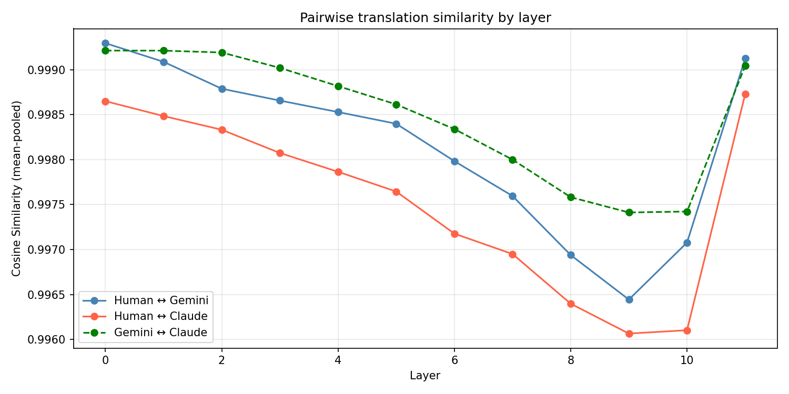
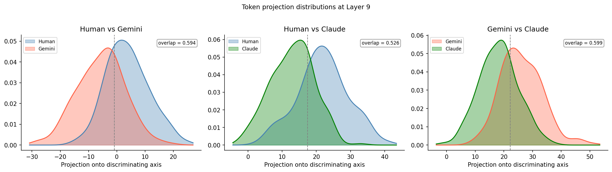
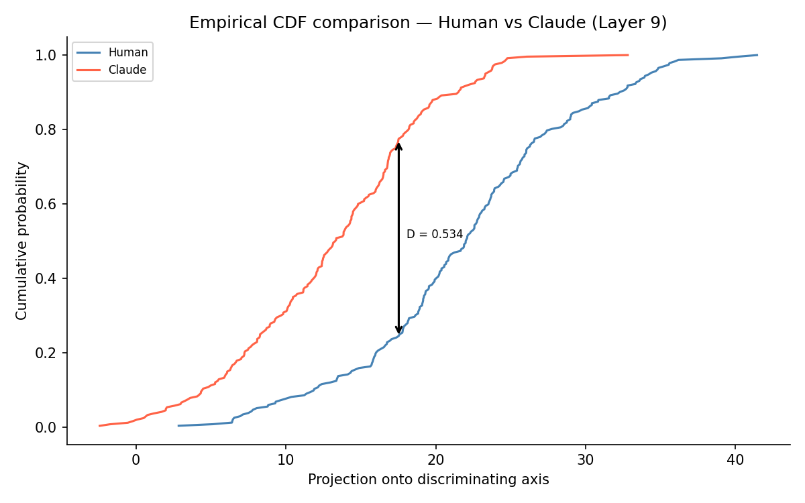
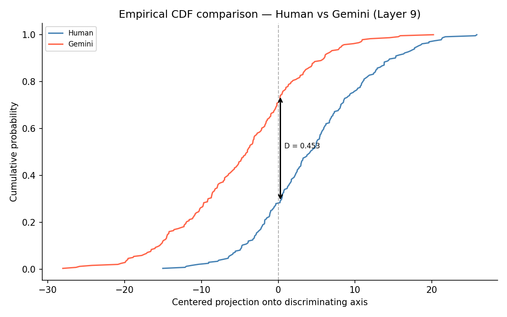
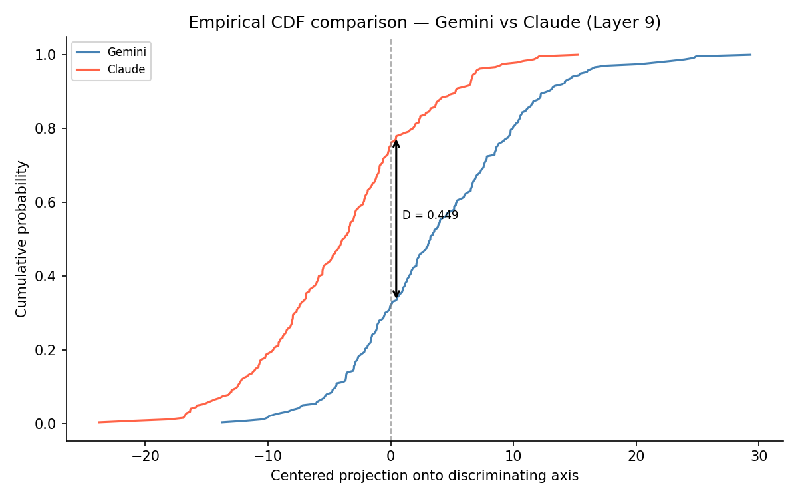

### Lost in Translation? Do LLMs translate the same way as human experts?
**Motivation:**
I loved reading the modern Spanish classic, "Love in the time of Cholera" by Nobel prize winner Gabriel Garcia Marquez - one of the great novels of the 20th century.  The English translation was done by Edith Grossman, who describes translating previous literature in one language into another as, "Translating is always a struggle, regardless of the author you're translating. You have to hear the original voice in a profound way, and then find the voice in English that best reflects that original. It's always difficult, challenging and immensely enjoyable."  I found myself re-reading passages that took my breath away and wondered how a translation could have this effect and if the original Spanish text would have had the same effect or greater.  While that is a complex human phenomena to uncover, I also wondered if LLMs can translate that beautifully.  So, I decided on a small pilot study.  I took one of my favorite passages from the English translation, then I took the original Spanish translation of that passage and had Gemini and Claude Sonnet provide their translations. 

**TL;DR**
The analysis code that follows compares the human translation to the two LLM translations.  What was discovered was while the overall cosine similarity across all layers was very similar to the human's translation, the two LLMs' translation was more similar to each other than they were to the Edith Grossman's.  Findings include consistent geometric separation between human and LLM translations across 11 layers (even though all three comparisons starts out very similar - pointing out that at the lexical level, all three are similar but stylistically they begin to diverge), maximum discriminability at layer 9, and token-level evidence that Grossman's translation is characterized by physical/sensory vocabulary while LLM translations favor abstract and explanatory word choices. 

**Approach:**
Linked below, first is the original Spanish passage, followed by Grossman's English translation, followed by Gemini 3's translation and Claude-Sonnet4.6's translation.
- [Original Spanish](passages.md#original-spanish)
- [Edith Grossman Translation](passages.md#edith-grossman--english-translation-1988)
- [Gemini](passages.md#gemini-translation)
- [Claude](passages.md#claude-translation) 
  
I chose this passage originally not because it represented a tricky translation for a human expert or for an LLM but because it was a beautiful piece of prose characterised by sensorial description of market life in a turn-of-the-century town in Latin America.  It has a surprise ending describing the ephemeral nature of human passions and it also is one of the most crucial turning points in the book.  

## A Note on Scope

This is a pilot study based on a single passage. The goal is to 
demonstrate a methodology and surface a consistent directional pattern 
across multiple independent analyses — not to make definitive claims 
about LLM translation style in general. Validating these findings 
would require replicating the analysis across many more passages.
 
**Analysis**\
**Part 1**: 
Pairwise cosine similarity of activations across all layers

$$\text{cos}(\mathbf{v}_A, \mathbf{v}_B) = \frac{\mathbf{v}_A \cdot \mathbf{v}_B}{\|\mathbf{v}_A\| \|\mathbf{v}_B\|}$$
  
  
  *Figure 1: Pairwise cosine similarity across GPT-2 (small) layers.  Gemini ↔ Claude (green dashed) is consistently most similar, while Human ↔ Claude (red) shows the greatest separation.*

  Figure 1 shows that overall all three translations when compared to each other have very similar activations across mostly all layers (cosine similarity > 0.99).  However, there is a consistent difference across all layers which stands out.  Claude and Gemini are more similar to each other than Claude is to Grossman or Gemini is to Grossman.  The largest difference happening in layer 9.  Further analysis (parts 3 and 4) breaks down which words in layer 9 had the highest activation and were distinctively human (or Claude or Gemini).  The next couple of analyses breaks this down further to understand what is responsible for the difference.

**Part 2**: Discriminating axis projection at layer 9
Figure 2 shows the amount of overlap in the token projections between each pair (Human <-> Claude, Human <-> Gemini, Gemini <-> Claude).  

The discriminating axis was computed by:
$$\mathbf{d} = \frac{\mathbf{v}_A - \mathbf{v}_B}{\|\mathbf{v}_A - \mathbf{v}_B\|}$$

The tokens were then projected onto the discriminating axis:
$$p_i = \mathbf{h}_i^{(l)} \cdot \mathbf{d}$$

**Overlap Analysis**:
A kernel-density estimation was performed and overlap computed as:
$$\text{overlap} = \int_{-\infty}^{\infty} \min(f_A(x), f_B(x)) \, dx$$

where $f_A(x)$ and $f_B(x)$ are the kernel density estimates of the token projection distributions for translations $A$ and $B$ respectively (see Figure 2), computed using a Gaussian kernel. Overlap ranges from 0 (no overlap) to 1 (identical distributions).
Figure 2 shows token projection distributions estimated with the kernel density estimate with the overlap coefficient also shown in the figure.
 
***Figure 2:** Kernel density estimates of token projection distributions onto the maximally discriminating axis at layer 9, for each translation pair. Each curve represents the distribution of projection values for content tokens from one translation. Greater separation between curves indicates more distinct representational signatures. The Gemini ↔ Claude 
pair (right-most) shows the most overlap, consistent with the two LLM translations being geometrically most similar in GPT-2's activation space.*

**Kolmogorov-Smirnov Statistic**:
The Kolmogorov-Smirnov statistic is a non-parametric test between two distributions that gives an indication of how similar the two are.  It works by measuring the supremum of vertical difference of the cumulative Distribution Function (CDF) of the two distributions.  Figures below visualize the CDFs between the pairs and again confirm the directional trend of that the difference between Grossman's and Gemini's and Grossman's and Claude's is bigger than Gemini's and Claude's.
  

  
   
  

  *Figure 3: Visualization the difference at the supremum of the pairs of CDFs (for the Kolmogorov-Smironov test).  Gemini ↔ Claude (green dashed) is consistently most similar, while Human ↔ Claude (red) shows the greatest separation.*

| Pair            | KS stat | overlap |
|-----------------|---------|---------|
| Human ↔ Gemini  | 0.453   | 0.594   |
| Human ↔ Claude  | 0.534   | 0.526   |
| Gemini ↔ Claude | 0.449   | 0.599   |

*Table 1: An overview of the KS stat and overlap coefficients for the three pair comparisions.  The two measures trend in the same direction (i.e Grossman's (human) translation being slightly different from each LLM's than the LLMs are to each other):  KS stat measures indicate that Gemini and Claude are more similar to each other (smallest differece) than Grossman's.  The overlap coefficient indicates that Gemini and Claude's projections overlap more than Grossman's does when compared with Claude's or Gemini's.*

Next, we examine, what word choices distinguish Grossman's translations compared to Gemini and Claude's at layer 9's most discriminating axis.

### Human vs Gemini — Layer 9 Discriminating Axis
**Definition:** For each translation pair, tokens are ranked by their 
projection value onto the discriminating axis $\mathbf{d}$. The 
*most distinctively A* tokens are the top $n$ tokens from translation A 
with the highest projection values; the *most distinctively B* tokens 
are the top $n$ tokens from translation B with the most negative 
projection values. Here $n = 15$.

### Human vs Gemini

| Distinctively Human | Proj | Distinctively Gemini | Proj |
|---------------------|------|----------------------|------|
| head | 24.98 | de | −28.91 |
| those | 24.81 | de | −27.19 |
| turned | 20.43 | angel | −26.73 |
| eyes | 20.36 | la | −25.10 |
| sudden | 19.48 | six | −21.73 |
| spot | 18.76 | funeral | −21.34 |
| smiled | 18.74 | messages | −20.79 |
| cloth | 17.84 | climate | −20.73 |
| round | 17.40 | sad | −20.44 |
| pointing | 16.88 | tumultuous | −19.77 |

---

Grossman's translation with words colored by their projection onto 
the discriminating axis between Grossman and Gemini at layer 9:
[Grossman vs Gemini](https://htmlpreview.github.io/?https://github.com/rnsundareswara/Marquez_interp/blob/main/results/colored_passage_human_gemini_L9.html) — green words are distinctively Grossman, red words are distinctively Gemini

### Human vs Claude

| Distinctively Human | Proj | Distinctively Claude | Proj |
|---------------------|------|----------------------|------|
| irresistible | 41.44 | mor | −2.42 |
| sudden | 40.15 | under | −1.75 |
| those | 39.06 | coc | −0.55 |
| head | 36.20 | messages | −0.22 |
| pointing | 35.93 | fire | 1.19 |
| cloth | 35.59 | invisible | 2.57 |
| turned | 35.55 | funeral | 2.97 |
| woman | 35.21 | Mic | 1.71 |
| shouting | 34.68 | al | 1.98 |
| complete | 33.96 | dis | 2.07 |

---

Grossman's translation with words colored by their projection onto 
the discriminating axis between Grossman and Claude at layer 9:
[Grossman vs Claude](https://htmlpreview.github.io/?https://github.com/rnsundareswara/Marquez_interp/blob/main/results/colored_passage_human_claude_L9.html) — green words are distinctively Grossman, red words are distinctively Claude

### Gemini vs Claude

| Distinctively Gemini | Proj | Distinctively Claude | Proj |
|----------------------|------|----------------------|------|
| de | 51.46 | gl | −1.61 |
| six | 47.03 | time | 1.10 |
| de | 46.84 | pet | 4.17 |
| six | 46.08 | eyes | 5.44 |
| completely | 38.77 | under | 5.52 |
| crazy | 38.53 | hand | 5.82 |
| announcing | 38.22 | heart | 5.88 |
| crying | 38.13 | wandering | 7.25 |
| la | 37.59 | head | 7.56 |
| six | 36.94 | capt | 6.97 |

---
And for completeness, Gemini's translation with words colored by their projection onto 
the discriminating axis between Gemini and Claude at layer 9:
[Gemini vs Claude](https://htmlpreview.github.io/?https://github.com/rnsundareswara/Marquez_interp/blob/main/results/colored_passage_gemini_claude_L9.html) — green words are distinctively Gemini, red words are distinctively Claude

A notable asymmetry in the results is that tokens distinctively associated with Grossman's translation tend to be complete, semantically meaningful words (*irresistible*, *sudden*, *cloth*, *woman*, *shouting*), while tokens distinctively associated with the LLM translations include subword fragments (*mor*, *coc*, *gl*, 
*de*, *la*).  This asymmetry is partly a **tokenization artifact**: GPT-2's byte-pair encoding tokenizer splits rare or foreign words into subword pieces. The Spanish candy names retained by Gemini (*de*, *la*, *angel*) and Claude's less common word choices are tokenized into fragments that then appear as "distinctive" simply because they have no equivalent in Grossman's translation. 
The fragments are not noise — they reflect genuine translation choices (Gemini's retention of Spanish terminology, Claude's particular vocabulary) — but their appearance as subwords rather than whole words is an artifact of the tokenizer, not a property of the translations themselves.  Regardless, The subword fragments appearing as distinctively Gemini tokens (*de*, *la*, *angel*) are not meaningless — they are pieces of Spanish candy names that Gemini chose to retain in the original Spanish (*cabellitos de ángel*, *alfajores*, *piononos*), which GPT-2's English-trained tokenizer then splits into subword 
fragments. Grossman translated these names into English equivalents (*angel hair*, *blancmanges*), which GPT-2 tokenizes as whole words.  The tokenization asymmetry is therefore itself a reflection of a genuine translation choice: Gemini foreignized while Grossman domesticated.
The cosine similarity ordering — the consistent ranking (Gemini↔Claude most similar, Human↔Claude least similar) across the 11 layers reflects something broader than just the candy name choices. The candy names are maybe 15-20 tokens out of 600. Mean-pooling over 600 tokens means they contribute ~3% of the signal. The ordering is unlikely to flip from removing them.  

**Part 3**: Token-level NLL / perplexity

$$\text{NLL}_i = -\log P(w_i \mid w_1, \ldots, w_{i-1})$$

The mean NLL is averaged over all tokens in the passage:

$$\overline{\text{NLL}} = \frac{1}{N} \sum_{i=1}^{N} \text{NLL}_i$$

Whole-text perplexity is the exponent of the mean NLL:

$$\text{PPL} = \exp\left(\overline{\text{NLL}}\right) = \exp\left(\frac{1}{N} \sum_{i=1}^{N} \text{NLL}_i\right)$$

A lower perplexity indicates GPT-2 finds the passage more predictable. 
Higher perplexity indicates the model is more surprised by the word choices.

| Translation     | Whole-text PPL | Mean NLL |
|-----------------|---------------|----------|
| Grossman (Human)| 38.6          | 3.65     |
| Gemini          | 44.4          | 3.79     |
| Claude          | 45.3          | 3.81     |

The whole text perplexity indicates how much the model is "surprised" by the entire passage.  Here, surprisingly, we see that GPT-2 is less surprised by Grossman's translation than Gemini's or Claude's.  I thought that this was quite an interesting result and not what I first expected.  But then, one reason for this result could be that Grossman's (English) language could be quite natural (and in-distribution) given that he knows the overall style of the book in Spanish.  but Claude's and Gemini's are a bit surprising - perhaps a bit out of context as the LLM translated it without knowing the overall style / context of the book ...?  It's something I am still thinking about.

## What This Pilot Shows

GPT2-decoder showed that while all three passages' started out as lexically similar at layer 0, but as you climb higher through the layers, the similarity measure reflects the accumulated representation - and Gemini-Claude become more and more similar to each other than Human-Claude and Gemini-Claude which is fascinating!  
No individual result in this study is statistically significant.  
However, across four independent analyses — pairwise cosine similarity 
profiles, NLL distributions, KS statistics, and discriminating axis 
projections at layer 9 — a consistent pattern emerges: Gemini and 
Claude translations are more similar to each other than either is to 
Grossman's. This consistency across methods is the central finding of 
this pilot, and motivates a larger study across multiple passages and 
multiple source texts.

## Reproducing this analysis

Dependencies: `pip install transformer-lens torch pandas 
               matplotlib numpy scikit-learn scipy`

Run: `python lc_v3.py`

Passages are in `prose.json`. Figures are saved to `results/`.

